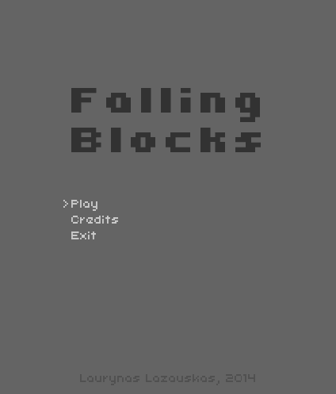

# Falling Blocks

A modified take on popular game Tetris written in C++ using Allegro5.



> :warning: **This project is old**: do not expect clean or exemplary code !

## How to run

The game is provided as source only. Use the script provided below to build and run the game yourself. Note that the script is targeted at Ubuntu. Adapt to your own system before running.

```bash
# Install dependencies
sudo apt install cmake liballegro5-dev

# Build
mkdir build && \
cmake -B build/ -S . && \
make --directory build

# Run
./FallingBlocks
```
